# How Devices Find Each Other Without IPs: The *mDNS* Story

by **Yuvraj Singh** · 18 minute read

---

I have four Raspberry Pis and a Mac, all on the same WiFi network and I wanted the Mac to find the Pis automatically, no hardcoded IPs anywhere, no `/etc/hosts`, no `ssh pi@192.168.1.something`. I just wanted them to appear to my Mac.


What follows is the actual conversation that got me there, reconstructed from my chat history. I've kept the questions as I asked them, including the dumb ones.

This covers the basics of a technology called *mDNS* and *Zeroconf* and how AirDrop uses it to find nearby devices. It also covers the Swift sidecar that [*smoltorrent*](https://github.com/smoltorrent/smoltorrent) uses to talk to Apple's AWDL peer-to-peer WiFi stack, and how the whole thing is logged. 

And in order to understand the concpet pratcially, we will be taking code snippets from this amazing libraray called [*grove*](https://github.com/grove/grove) built by -

---

**Me: ok so I want the Pis to show up on the Mac without me knowing their IPs. how does something like AirDrop do that? like it just finds your phone...**

*Teacher: Good question to start with because AirDrop is actually three or four different technologies stacked on top of each other. But the foundation is something called Zeroconf, zero configuration networking. Let's start there.*

*Zeroconf is not one protocol, it's a suite of three things that work together:*

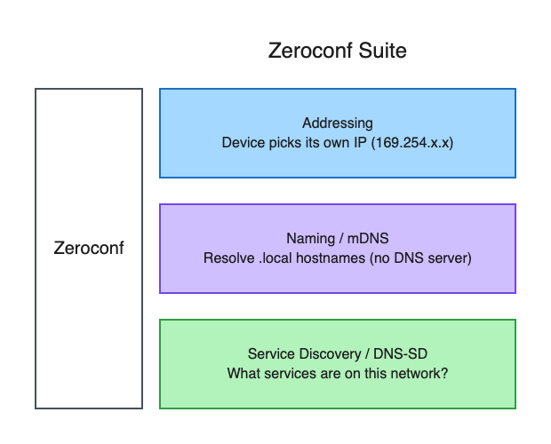

*For your use case, the second one is what matters. mDNS is the engine.*

**Me: ok but what's mDNS?**

*Teacher: Regular DNS works like a phone book with a librarian. You ask the librarian (a DNS server at say 8.8.8.8), they look it up and tell you the IP.*

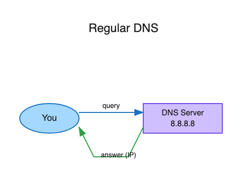

*mDNS removes the librarian. Instead of asking one server, you shout into the whole room and whoever knows the answer shouts back.*

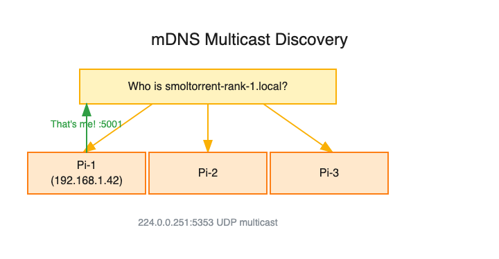

*Every device on the network joins a multicast group at address `224.0.0.251` and listens on UDP port `5353`. When someone sends a question to that address, every device on the LAN hears it. The one that knows the answer responds.*

**Me: why UDP and not TCP?**

*Teacher: TCP is a private conversation between exactly two endpoints. You do the three-way handshake, establish a connection, send bytes, close it. You physically cannot send one TCP packet to multiple recipients at once. The protocol doesn't support it.*

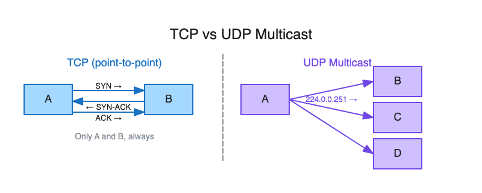

*Also, discovery packets are tiny. Like a few hundred bytes. If you used TCP for that, the handshake overhead would be larger than the actual message.*

*UDP is **fire and forget**, that is, you toss the packet, and be done with it.*

**Me: what's special about that 224.0.0.251 address?**

*Teacher: The whole `224.x.x.x` range is reserved for multicast. `224.0.0.251` is specifically IANA-assigned for mDNS. No other protocol uses it.*

*The part that matters more than the address is the TTL, which is hardcoded to 1.
TTL is Time To Live: routers decrement it on every hop, and drop the packet when it hits zero. A TTL of 1 means the packet literally cannot survive being forwarded.*

*Your Pi's mDNS advertisement stays on your LAN. It can't leak to the internet or bleed into another network segment even if your router is misconfigured.*

*So the full picture: UDP, multicast to `224.0.0.251`, port `5353`, TTL=1. The kernel joins the multicast group for you. You just open the socket and start talking.*

**Me: ok so how does [*grove*](https://github.com/grove/grove) actually use this**

*Teacher: Each Pi, when it starts up, runs a `WorkerAdvertiser`. It announces itself with its rank, IP, port, and hostname:*

```python

# discovery/grove/_mdns.py

class WorkerAdvertiser:
    def __init__(self, rank: int, port: int, hostname: str | None = None) -> None:
        host = hostname or socket.gethostname()
        ip = _get_local_ip()
        self._zc = Zeroconf()
        self._info = ServiceInfo(
            "_smoltorrent._tcp.local.",
            f"smoltorrent-rank-{rank}._smoltorrent._tcp.local.",
            addresses=[socket.inet_aton(ip)],
            port=port,
            properties={
                b"rank": str(rank).encode(),
                b"hostname": host.encode(),
            },
        )
        self._zc.register_service(self._info, allow_name_change=True)
```

*The master side runs a browser that listens for those announcements:*

```python
def discover_mdns_workers(timeout: float = 10.0) -> list[dict]:
    found: dict[int, dict] = {}
    lock = threading.Lock()

    class _Listener:
        def add_service(self, zc, type_, name):
            info = zc.get_service_info(type_, name)
            if info and info.addresses:
                ip = socket.inet_ntoa(info.addresses[0])
                with lock:
                    found[rank] = {"ip": ip, "port": info.port, "rank": rank, ...}

    zc = Zeroconf()
    browser = ServiceBrowser(zc, "_smoltorrent._tcp.local.", _Listener())
    time.sleep(timeout)
    browser.cancel()
    zc.close()
    return sorted(found.values(), key=lambda x: x["rank"])
```

*After 10 seconds, the master has this:*

```python
[
    {"ip": "192.168.1.42", "port": 5001, "rank": 1, "hostname": "pi4-1"},
    {"ip": "192.168.1.43", "port": 5002, "rank": 2, "hostname": "pi4-2"},
    ...
]
```

*No hardcoded IPs. No config files. Workers announced themselves, master listened.*

*This was the moment it clicked for me: the cluster could move to a different network, the Pis could get new DHCP leases overnight, and nothing would break. The code just works.*

---

**Me: ok that makes sense for when everything is on the same WiFi. but how does AirDrop work when there's literally no router, like on a plane or in a field**

*Teacher: That's where AWDL comes in. Apple Wireless Direct Link. It's Apple's own peer-to-peer WiFi that requires no access point at all.*

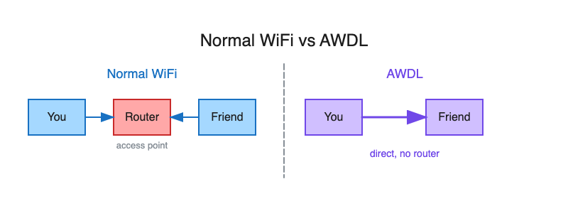

**Me: but both devices need to be on the same WiFi channel right? how does that work if there's no router coordinating anything**

*Teacher: This is the clever part. Your WiFi chip can only tune to one channel at a time. AWDL works around that by time-slicing. Your phone is mostly on your normal WiFi channel, but every 100 milliseconds or so it briefly switches to an AWDL channel for about 16 milliseconds, listens for any nearby devices, then switches back.*

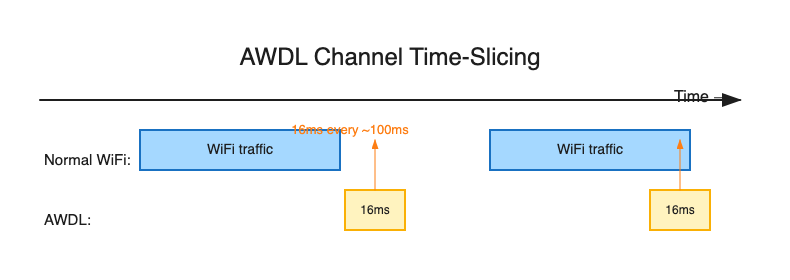

*Your video call or web browsing doesn't notice. 16ms out of every 100ms is invisible to TCP.*

**Me: so what channels does it use**

*Teacher: Three specific ones called social channels:*

```
Channel 6   ── 2.4 GHz, most common
Channel 44  ── 5 GHz
Channel 149 ── 5 GHz
```

*Devices cycle through these in a fixed sequence. When two devices happen to be on the same social channel at the same time, they exchange tiny packets called AWDL Action Frames with timing info. One device becomes the coordinator and broadcasts the schedule. Everyone else aligns to it.*

*That's why AirDrop sometimes takes a few seconds to show a nearby device. The two devices' AWDL windows need to overlap and sync up first.*

**Me: and then AirDrop uses this to discover the other device?**

*Teacher: Just the discovery part. Once two devices find each other through AWDL, the actual file transfer happens over a dedicated WiFi Direct connection at full speed. AWDL is the matchmaker, not the pipe.*

*The full AirDrop flow is four separate phases:*

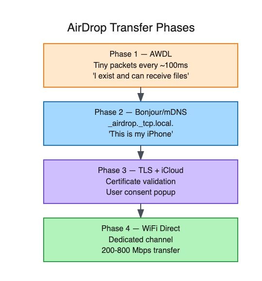

**Me: ok and smoltorrent uses AWDL too?**

*Teacher: For the discovery part. The problem is Python can't talk to AWDL directly. AWDL is exposed through Apple's `Network.framework`, which is a Swift and Objective-C API. There's no Python binding for it and the kernel interfaces are private.*

*So we needed a different approach.*

---

**Me: ok so how do you get Python to use something only Swift can do**

*Teacher: You write a small Swift binary that does the AWDL part and have Python talk to it through a file on disk.*

**Me: a file on disk?**

*Teacher: A Unix Domain Socket. It looks like a file, it lives in `/tmp/`, but it behaves exactly like a network socket. You read from it, write to it, and data flows between the two processes. Zero actual network traffic, it all happens in kernel memory.*

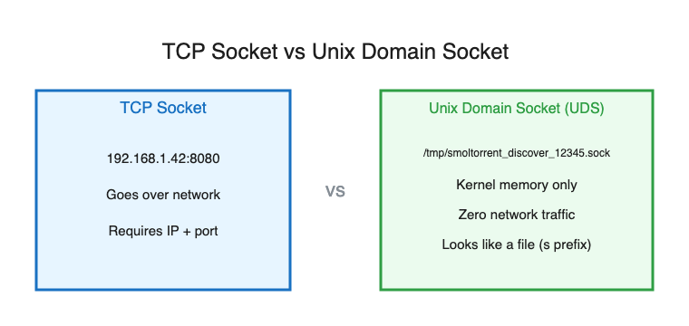

*If you `ls -la` that path, you see it has `s` at the front instead of `-` or `d`:*

```
srwxr-xr-x  1 yuvraj  wheel  0 Jun 9 14:30 /tmp/smoltorrent_discover_12345.sock
^
's' = socket file
```

**Me: how does the Swift binary get created in the first place**

*Teacher: Python compiles it on demand. The `.swift` source file ships with the repo. When you first run discovery, Python checks if the compiled binary exists. If not, it runs `swiftc` to compile it:*

```python

# discovery/grove/swift/compile.py

def ensure_compiled() -> Path:
    result = subprocess.run(
        ["swiftc", "-O", "-o", str(bin_path), str(_SWIFT_SRC)],
        capture_output=True, text=True,
    )
    # produces a native binary at ~/.grove/bin/grove-p2p-helper
```

*The `-O` flag optimizes it, `-o` sets the output path. After that you have a native binary that runs directly on the CPU, same as any compiled C program.*

**Me: and then Python just launches it as a subprocess?**

*Teacher: Exactly. Python spawns it, the Swift process creates a UDS and waits for Python to connect, then they talk:*

*Swift side, creates the server socket:*

```swift
func createUDS(_ path: String) -> Int32 {
    let fd = socket(AF_UNIX, SOCK_STREAM, 0)   // Unix socket, not TCP
    unlink(path)                                // clean up old socket if it exists
    var addr = sockaddr_un()
    addr.sun_family = sa_family_t(AF_UNIX)
    bind(fd, ...)
    listen(fd, 1)
    return fd
}

let serverFd = createUDS(controlPath)
let fd = accept(serverFd, nil, nil)   // blocks here until Python connects
```

*Python side, connects as client:*

```python
sock = socket.socket(socket.AF_UNIX, socket.SOCK_STREAM)

#                       ^^^^^^^^
#                       Not AF_INET (TCP), AF_UNIX (file path)

sock.connect("/tmp/smoltorrent_discover_12345.sock")
# now sock.send() and sock.recv() work exactly like TCP
```

**Me: and then Swift sends discovery results through this socket?**

*Teacher: Yes. For the discovery phase it sends plain text lines, one per device found:*

```
Swift writes:  "ready\n"
Swift writes:  "found My-MacBook abc123 4 train.py\n"
Swift writes:  "lost abc123\n"
```

*Python reads byte by byte, looking for the newline that marks the end of each message:*

```python
def _read_line(sock: socket.socket) -> str:
    buf = b""
    while not buf.endswith(b"\n"):
        chunk = sock.recv(1)
        if not chunk:
            break
        buf += chunk
    return buf.decode().strip()
```

**Me: hold on, why not just call readline() or read until newline in one shot? reading one byte at a time seems obviously wrong**

*Teacher: `readline()` works on file objects, not raw sockets. And `recv(N)` reads **up to** N bytes, and there's no way to tell it "stop when you hit a newline" without buffering and risking consuming the start of the next message. One byte at a time is the honest version of that buffering. For discovery, which gets maybe five messages across ten seconds, the overhead is nothing. Simplicity wins here.*

**Me: what's the full picture then, how does the whole thing fit together**

*Teacher: Here it is end to end:*

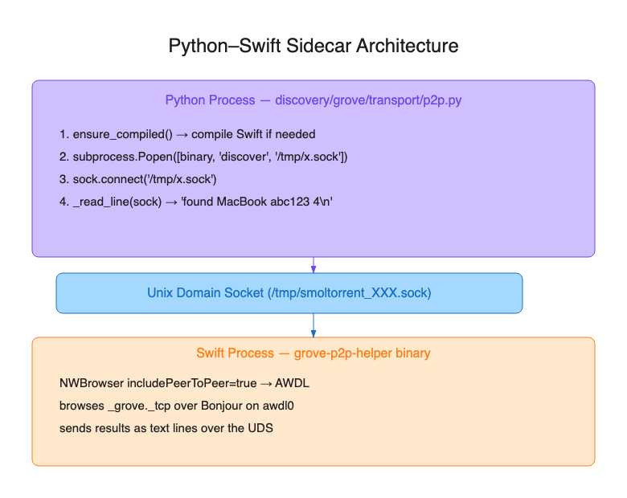

*That `includePeerToPeer = true` flag is the key. It tells Apple's networking framework to browse on the `awdl0` interface instead of the normal `en0` WiFi interface. That's the one line that enables AWDL discovery.*

---

**Me: ok you mentioned binary data earlier. if you're sending tensor weights through a socket you can't use newlines as delimiters right?**

*Teacher: Right. Tensor data is raw bytes. Any byte value from 0 to 255 can appear anywhere. The value 10 in decimal is `\n`. If your model weights happen to contain that byte, a newline-delimited protocol would split your message in half.*

*So for binary data you use length-prefixed framing instead. First you send a 4-byte header that says how many bytes are coming, then you send exactly that many bytes.*

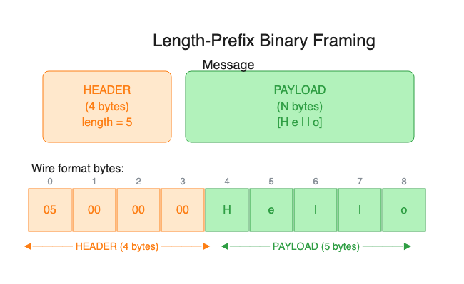

**Me: why 4 bytes for the header**

*Teacher: A 4-byte unsigned integer can represent up to about 4 gigabytes. Enough for any model shard you'd be sending.*

**Me: and TCP just gives you all these bytes in order? like you don't need to worry about packets?**

*Teacher: TCP guarantees order and delivery. But there's a thing people get wrong. TCP is a byte stream, not a message protocol. It has no concept of where one `send()` ends and the next begins.*

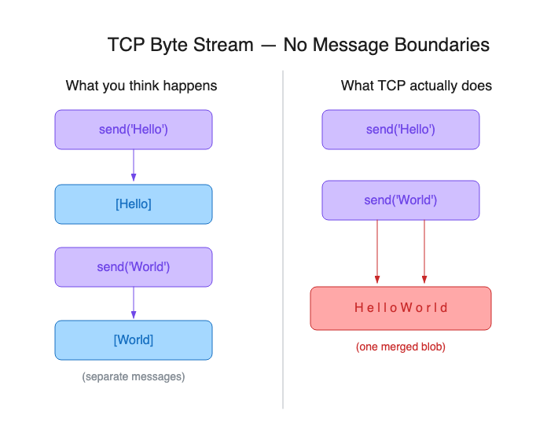

*The receiver sees `"HelloWorld"`. There's no boundary. TCP handles retransmission, ordering, congestion. But message boundaries are entirely your problem.*

**Me: so I have to implement that buffering myself, accumulate bytes until I have enough to parse a full frame?**

*Teacher: Exactly. The receiver keeps a running buffer, checks whether it has enough bytes for a header, reads the length, checks whether it has enough bytes for the full payload, extracts it, removes those bytes from the front, and loops. Like this:*

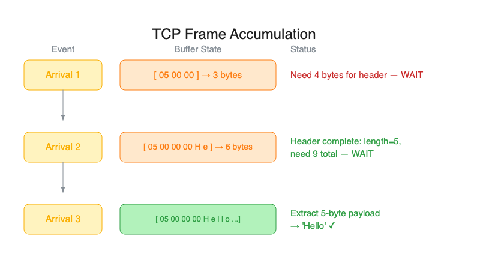

*This is what the Swift `FrameReader.drainFrames()` does:*

```swift
private func drainFrames() {
    while buffer.count >= 4 {
        let length = Int(buffer.withUnsafeBytes {
            $0.load(as: UInt32.self).littleEndian
        })
        guard buffer.count >= 4 + length else { return }
        let payload = buffer.subdata(in: 4..<(4 + length))
        buffer.removeSubrange(0..<(4 + length))
        handler(payload)
    }
}
```

*The full picture of what you control versus what TCP controls:*

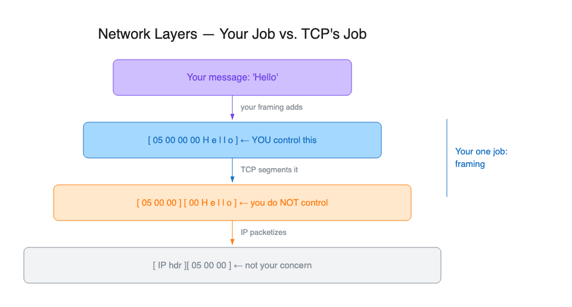

*Your one job is framing.*

---

**Me: so smoltorrent runs both mDNS and AWDL? at the same time?**

*Teacher: Yes, in parallel threads. mDNS works on a normal LAN. AWDL works without any router. Running both means the cluster works in either situation.*

```python

# discovery/__init__.py

def discover_workers(timeout: float = 10.0) -> list[dict]:
    mdns_results: list[dict] = []
    airdrop_results: list[dict] = []

    t_mdns = threading.Thread(target=_run_mdns, daemon=True)
    t_awdl = threading.Thread(target=_run_airdrop, daemon=True)
    t_mdns.start()
    t_awdl.start()
    t_mdns.join()
    t_awdl.join()

    # mDNS wins on conflict because it has verified IP and port
    merged: dict[int, dict] = {}
    for worker in mdns_results:
        merged[worker["rank"]] = worker
    return sorted(merged.values(), key=lambda x: x["rank"])
```

| Method | Transport | Interface | Needs router |
|--------|-----------|-----------|-------------|
| Python mDNS | `224.0.0.251:5353` UDP | `en0` (WiFi) | Yes |
| Swift AWDL | AWDL multicast, ch 6/44/149 | `awdl0` | No |

**Me: the Swift sidecar setup and teardown is repeated for both the one-shot discovery and the live browser mode right? is that not a lot of duplication**

*Teacher: It was, which is why it got refactored into one context manager that both paths share:*

```python
@contextmanager
def _swift_discover(label: str) -> Generator[socket.socket, None, None]:
    setup_grove_logging()
    helper_path = ensure_compiled()
    ctrl_path = f"/tmp/smoltorrent_{label}_{os.getpid()}.sock"
    proc = subprocess.Popen(
        [str(helper_path), "discover", ctrl_path], stderr=subprocess.PIPE
    )
    threading.Thread(target=_log_stderr, args=(proc, label), daemon=True).start()

    sock = None
    deadline = time.monotonic() + 30.0
    while time.monotonic() < deadline:
        try:
            sock = socket.socket(socket.AF_UNIX, socket.SOCK_STREAM)
            sock.connect(ctrl_path)
            break
        except (FileNotFoundError, ConnectionRefusedError):
            time.sleep(0.05)

    if sock is None:
        proc.terminate()
        yield None
        return

    _read_line(sock)  # consume "ready"
    try:
        yield sock
    finally:
        sock.close()
        proc.terminate()
        proc.wait(timeout=3)
        if os.path.exists(ctrl_path):
            os.unlink(ctrl_path)
```

*One-shot uses it with a fixed timeout:*

```python
def discover_airdrop_workers(timeout: float = 10.0) -> list[dict]:
    nodes: list[dict] = []
    with _swift_discover("discover") as sock:
        if sock is None:
            return []
        sock.settimeout(1.0)
        end_time = time.monotonic() + timeout
        while time.monotonic() < end_time:
            text = _read_line(sock)
            if text.startswith("found "):
                node = _parse_node(text)
                if node:
                    nodes.append(node)
    return nodes
```

*Live browser holds it open indefinitely:*

```python
class AirdropBrowser:
    def __init__(self):
        self._ctx = _swift_discover("live")
        self._sock = self._ctx.__enter__()
        threading.Thread(target=self._read_loop, daemon=True).start()

    def close(self):
        self._ctx.__exit__(None, None, None)
```

*Same setup, same teardown, different lifecycles.*

---

**Me: the Swift process also prints debug stuff right? where does that go**

*Teacher: The Swift process has three output channels and they go to three different places:*

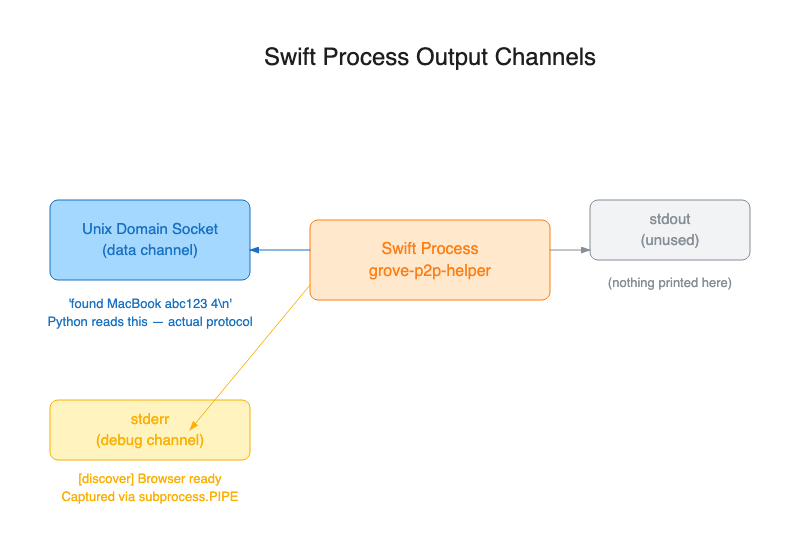

*The `stderr=subprocess.PIPE` in the Popen call captures Swift's debug output. A daemon thread reads it and routes it into the grove log at DEBUG level:*

```python
proc = subprocess.Popen(
    [str(helper_path), "discover", ctrl_path],
    stderr=subprocess.PIPE
)

def _log_stderr(proc, label):
    for raw_line in proc.stderr:
        line = raw_line.decode(errors="replace").strip()
        if line:
            _log.debug("[swift %s] %s", label, line)
```

*This way Swift's debug noise doesn't leak into the terminal but is still available in the log file if something goes wrong.*

---

**Me: what's the convention for logs in this project, I keep seeing [mdns] and [p2p] at the front**

*Teacher: That's intentional. Every log line starts with a bracketed tag that says which module it came from:*

```
[mdns]    = mDNS zeroconf discovery
[p2p]     = Python-side AWDL logic
[swift]   = Swift binary stderr routed into grove log
[api]     = backend API server
[syncps]  = SyncPS worker on the Pis
[watcher] = file watcher daemon
```

*The reason is grep. When something breaks you want to pull out exactly the lines you care about:*

```bash

# only discovery events
grep -E '\[(mdns|p2p|swift)\]' logging/grove/discovery.log

# only errors across all logs
grep 'WARNING\|ERROR' logging/**/*.log

# everything from rank 3 worker
grep '\[syncps\]' logging/cluster-logs/*.log | grep 'rank 3'
```

*Without the tags you're reading unstructured text and searching for patterns. With them you have lightweight structured logging with no dependencies.*

**Me: and the log levels?**

*Teacher: Four levels, each with a specific meaning:*

| Level | When to use | Example |
|-------|-------------|---------|
| DEBUG | Verbose internals, Swift stderr | `[p2p] AWDL helper connected` |
| INFO | Normal milestones | `[mdns] discovery finished, 4 workers` |
| WARNING | Recoverable problems | `[p2p] Swift helper didn't start within 30s` |
| ERROR | Unrecoverable failures | `[swiftc] compilation failed` |

**Me: where do the log files actually go**

*Teacher: All grove logs write to `logging/grove/discovery.log`. The setup is idempotent so you can call it from any entry point and it only configures once:*

```python
def setup_grove_logging(level: int = logging.INFO, *, log_dir=None) -> Path:
    global _FILE_LOGGING_SETUP
    if _FILE_LOGGING_SETUP:
        return _GROVE_LOG_DIR   # already set up, skip

    grove_dir = Path(__file__).resolve().parents[3] / "logging" / "grove"
    grove_dir.mkdir(parents=True, exist_ok=True)
    log_path = grove_dir / "discovery.log"

    parent = logging.getLogger("grove")
    fh = logging.FileHandler(log_path, mode="a")
    fh.setFormatter(logging.Formatter(
        "%(asctime)s  %(levelname)-8s  [grove]  %(name)s  %(message)s",
        datefmt="%Y-%m-%d %H:%M:%S",
    ))
    parent.addHandler(fh)
    _FILE_LOGGING_SETUP = True
    return log_path
```

*A real log looks like:*

```
2026-06-09 14:30:01  INFO      [grove]  grove.mdns   [mdns] worker advertised: rank=1 host=pi4-1 ip=192.168.1.42 port=5001
2026-06-09 14:30:01  INFO      [grove]  grove.p2p    [p2p] starting AWDL discovery (timeout=10s)
2026-06-09 14:30:02  DEBUG     [grove]  grove.p2p    [swift discover] Browser ready
2026-06-09 14:30:02  INFO      [grove]  grove.p2p    [p2p] found node: MacBook (uid=abc123)
2026-06-09 14:30:10  INFO      [grove]  grove.mdns   [mdns] discovery finished, 4 workers found
```

---

## Quick reference

| Concept | What it is |
|---------|-----------|
| Zeroconf | Suite of protocols: link-local addressing + mDNS + DNS-SD |
| mDNS | Multicast DNS, replaces DNS server with `224.0.0.251:5353` UDP multicast |
| `224.0.0.251` | Link-local multicast address, TTL=1, never leaves your LAN |
| Port `5353` | IANA-assigned for mDNS |
| UDP not TCP | TCP cannot multicast, discovery packets are tiny and stateless |
| AWDL | Apple peer-to-peer WiFi using time-sliced channel hopping, no router needed |
| Social channels | Channels 6, 44, 149 where AWDL chirps happen every ~100ms |
| Bonjour | Apple's brand name for Zeroconf and mDNS |
| AirDrop | AWDL discovery + Bonjour advertising + WiFi Direct transfer + iCloud identity |
| UDS | Unix Domain Socket, a file path that acts like a TCP socket with zero network overhead |
| Sidecar | Swift binary launched by Python, communicating over a UDS |
| `includePeerToPeer = true` | Swift flag that routes Bonjour over `awdl0` instead of `en0` |
| TCP framing | TCP is a byte stream, you need delimiters or length-prefixed headers to create message boundaries |
| Length prefix | First 4 bytes = message length as LE UInt32, rest = payload |
| `[tag]` convention | Every log line starts with `[module]`, makes grep instant |

---

Getting all the way to `discover_workers()` returning four live IPs felt like a lot of machinery for what ultimately just replaces a config file. But each piece has a specific reason to exist: mDNS for normal LAN conditions, AWDL for the no-router case, the Swift sidecar because Python has no path into Apple's peer-to-peer stack, the UDS because cross-process communication doesn't need a network, the length-prefixed framing because TCP won't draw your message boundaries for you. None of it is accidental.

The full code is in `discovery/grove/`.

---

Getting the cluster to discover itself was the interesting problem. Getting it to *start itself* (no keyboard, no login, just reboot and walk away) turned out to be the annoying one.

# Making the Cluster Start Itself: LaunchDaemons, Boot Timing, and a Bug That Shouldn't Exist

by **Yuvraj Singh** · 12 minute read

---

The cluster worked perfectly when I started it by hand. Getting it to start automatically on reboot felt like a 10-minute job. No keyboard, no login, just come back in two minutes and everything is running. Drop a plist in the right folder, register it with launchd, done.

Three separate macOS surprises later, here is the actual conversation that got me there.

---

**Me: ok so all I need is to put a plist in `~/Library/LaunchAgents/` and it runs on startup right? I've seen that in tutorials**

*Teacher: That used to be the move. On Ventura, Sonoma, even Sequoia, you'd drop a `.plist` into `~/Library/LaunchAgents/`, run `launchctl load` on it, and you were done.*

*macOS 26 Tahoe removed `launchctl load` entirely. It had been deprecated for a while and Apple finally pulled it. If you run it now the process gets SIGABRT and exits with code 134. No warning, no helpful message. It just dies.*

**Me: ok fine, I read somewhere you're supposed to use `launchctl bootstrap gui/501` now**

*Teacher: That is the newer way, yeah. `501` is usually your UID on a single user Mac, you can check with `id -u`. In theory `launchctl bootstrap gui/501 ~/Library/LaunchAgents/yourfile.plist` loads and starts the agent.*

*In practice, on macOS 26 beta right now, that command returns error 125 and does nothing. The GUI domain is broken. Apple is aware. It will probably get fixed in a later beta. But it was not fixed when we were sitting here trying to make this work.*

**Me: so LaunchAgents are just... broken?**

*Teacher: For the command line path, yes. Apple's intended replacement is `SMAppService`, a Swift API you call from inside a real Mac app, and the system manages everything from there. It shows up as a login item in System Settings. That's genuinely the right long-term answer.*

*It's also an entire Mac app to write just to start a Python server. So: not today.*

**Me: ok so what do we actually do**

*Teacher: We move down one level. Instead of a LaunchAgent, we use a LaunchDaemon.*

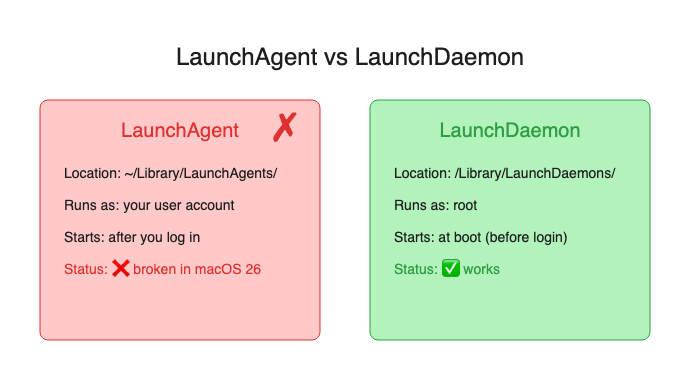

*The plist goes in `/Library/LaunchDaemons/`. You load it like this:*

```bash
sudo launchctl enable system/com.smoltorrent.startup
sudo launchctl bootstrap system /Library/LaunchDaemons/com.smoltorrent.startup.plist
```

**Me: why enable before bootstrap? that feels backwards, like I'm enabling something that doesn't exist yet**

*Teacher: Good catch, it does feel weird. Here's what each one actually does.*

*`enable` writes a record into launchd's persistent database that says this service is allowed to run and should survive reboots. `bootstrap` loads the service and starts it right now, this session.*

*If you run only `bootstrap`, the service starts immediately and works fine today. But launchd has no record of it, so after the next reboot it's gone. If you run `enable` first, launchd knows to bring it back every time the system boots. So the order is: tell launchd to remember it, then tell launchd to start it.*

**Me: ok I ran it and got error 5**

*Teacher: Error 5 means launchd thinks the service is already in some partial state, usually from a previous attempt that didn't fully clean up. You need to evict it completely and start fresh.*

```bash
sudo launchctl bootout system/com.smoltorrent.startup 2>/dev/null || true
sudo launchctl enable system/com.smoltorrent.startup
sudo launchctl bootstrap system /Library/LaunchDaemons/com.smoltorrent.startup.plist
```

*`bootout` is the opposite of `bootstrap`. It fully removes the service from launchd's memory. The `2>/dev/null || true` is just saying "if it wasn't loaded in the first place, that's fine, keep going." Then you enable and bootstrap clean.*

**Me: ok that worked. but now the script runs and immediately fails because the workers aren't reachable yet**

---

## Tailscale Isn't Ready Yet (And Nobody Tells You That)

*Teacher: Right. The daemon starts at boot. Tailscale also starts at boot. But Tailscale is not instant. It needs a few seconds to bring up the VPN tunnel and authenticate with the coordination server. If the smoltorrent startup script fires immediately, it tries to SSH into workers whose IPs don't exist yet on this machine, fails, and exits.*

**Me: can I just put a `sleep 10` at the top?**

*Teacher: You could. The problem is you don't know how long Tailscale will take. On a clean fast boot maybe 3 seconds. After a system update, maybe 30. A hardcoded sleep is either too short and you still get a race, or way too long and you're just sitting there waiting for no reason.*

*The right move is to poll. Pick one worker and keep pinging it until you get a reply.*

```bash
TAILSCALE_PROBE="100.68.124.90"   # pi4-1, first worker to come up
TIMEOUT=300

deadline=$(( $(date +%s) + TIMEOUT ))
until ping -c1 -W1 "$TAILSCALE_PROBE" >/dev/null 2>&1; do
    if [ "$(date +%s)" -ge "$deadline" ]; then
        echo "timeout, network never came up"
        exit 1
    fi
    sleep 5
done
```

*`ping -c1` sends one packet. `-W1` means wait at most 1 second for a reply. The loop checks every 5 seconds. Once that ping succeeds, Tailscale is up and the worker is reachable. Then we proceed.*

**Me: why ping the worker instead of just running `tailscale status`?**

*Teacher: `tailscale status` tells you if the local Tailscale daemon started and authenticated. That's not enough. A successful ping to the worker's Tailscale IP means the VPN is actually routing traffic to that specific machine right now. That's the thing we actually need. It's the most direct test.*

**Me: why pi4-1 specifically?**

*Teacher: Just because it's whichever worker boots fastest. The idea is to pick a canary, one machine you expect to be up first. If that one is reachable, the whole VPN is working. You can change that IP to whichever of your workers tends to come online quickest.*

---

## Root Can't Read Your Desktop (And It Won't Say Why)

**Me: ok the timing works now but the script is erroring with permission stuff when it tries to read files**

*Teacher: Where does your code live?*

**Me: oh, I had it on the Desktop originally**

*Teacher: That's the problem. System daemons run as root. macOS has a thing called TCC, Transparency Consent and Control, which is what prompts you when an app wants to access your Desktop or Documents or Downloads. For root processes launched by launchd, those TCC prompts never happen. The access is just silently blocked.*

*So if your code or your checkpoint data lives in `~/Desktop`, `~/Documents`, or `~/Downloads`, a LaunchDaemon cannot read it. No error that makes it obvious. The path exists, the file exists, but the read fails.*

*I spent about 20 minutes convinced the subprocess was running in the wrong working directory before it occurred to me to check what root can actually see.*

**Me: so I just move the repo out of Desktop?**

*Teacher: Exactly. Keep it in `~/smoltorrent/` and your checkpoints in `~/smolcluster/checkpoints/`. Neither of those is a TCC-protected folder, root can read both without issues.*

*One more thing: the startup script itself gets copied to `/usr/local/bin/` before the daemon runs it. Scripts in `/usr/local/bin/` have zero TCC restrictions regardless of who calls them. That's why the plist points there instead of directly into the repo.*

---

## What Is node_exporter Doing in the Startup Script?

**Me: hey wait, there's this in the startup script**

```bash
NODE_EXPORTER=/opt/homebrew/opt/node_exporter/bin/node_exporter
if [ -x "$NODE_EXPORTER" ]; then
    "$NODE_EXPORTER" --web.listen-address=":9100" >> /tmp/node_exporter.log 2>&1 &
fi
```

**why is a metrics thing starting with the cluster**

*Teacher: Each Pi runs a process called `node_exporter` that exposes system stats, CPU, memory, disk, network, at port 9100. Prometheus scrapes all four of them and Grafana shows you the dashboards.*

*The Mac is also part of the cluster. If you want to see what the master is doing during a gather operation, how much CPU it's using, how much network bandwidth, it needs to expose those same stats. Putting it in the startup script means it comes up automatically.*

**Me: but what if I don't have it installed**

*Teacher: The `if [ -x ... ]` check handles that. `-x` means "does this file exist and is it executable." If node_exporter isn't there, the block is skipped entirely and the rest of the script continues. It's completely optional.*

---

## A Bug That Took One Second to Fix and Should Not Have Existed

**Me: ok I run grove and I get this**

```
File "discovery/grove/_utils.py", line 94, in get_logger
    if not logger.handlers:
           ^^^^^^
NameError: name 'logger' is not defined
```

*Teacher: Look at the function. It's called `get_logger(name)` and its entire job is to create and return a logger for whatever name you pass in. But inside the function, the code uses a variable called `logger` that was never created.*

```python

# broken
def get_logger(name: str) -> logging.Logger:
    if not logger.handlers:     # what is logger? never defined
        ...
    return logger
```

*The line that should be at the top of the function body is:*

```python
logger = logging.getLogger(f"grove.{name}")
```

*That creates the logger from the `name` argument. Then the rest of the function checks if it already has handlers before adding more. Without that line, `logger` is just an undefined name.*

**Me: how does something like that even get in there**

*Teacher: Most Python modules define a module-level logger at the top of the file, something like `logger = logging.getLogger(__name__)`. The function was probably written when that module-level variable existed, so referencing `logger` inside the function worked because Python found it in the enclosing module scope.*

*At some point the module-level logger got removed or the code got moved into this utility function with a `name` parameter, but the function body was never updated. The signature changed. The body did not.*

*Python won't catch this at import time. It only evaluates the inside of a function when you call it. So if nothing in the tests directly called `get_logger`, this sat there invisible until the first real run.*

**Me: one line fix**

*Teacher: One line. The annoying kind: not a subtle bug, just a variable that got orphaned when someone refactored the module-level logger into a parameterised helper function and forgot to update the body. I didn't check `git blame`.*

---

## What the Full Boot Sequence Looks Like

After all of this, here is what actually happens when the Mac reboots:

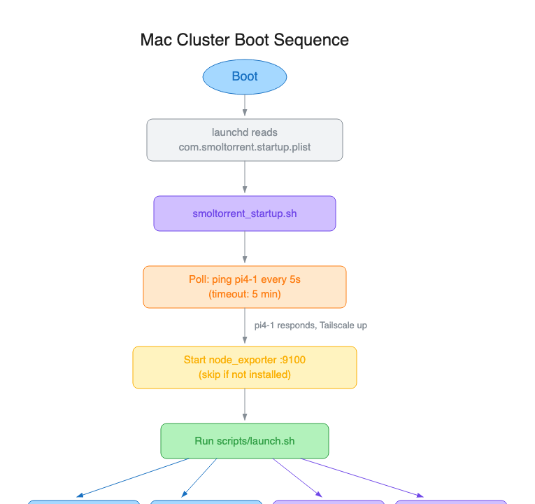

No keyboard. No login. Reboot the Mac, come back in two minutes, the cluster is running.

---

## Three Files You Have to Change for Your Own Setup

Everything above is wired to specific IPs and paths that belong to this particular machine and cluster. If you are setting this up fresh, these are the three places to change:

**`configs/config.yaml`** is the source of truth. Your Tailscale IPs, SSH hostnames, and ports all go here. Almost everything else in the codebase reads from this file at runtime.

**`scripts/smoltorrent_startup.sh`** has two lines at the top:
- `SMOLTORRENT_DIR` needs to point to wherever you cloned the repo
- `TAILSCALE_PROBE` needs to be the Tailscale IP of whichever worker comes online first on your cluster

**`monitoring/prometheus/prometheus.yml`** has every worker IP hardcoded. Do not edit it by hand. Run `bash scripts/launch_monitoring.sh` instead. That script reads `configs/config.yaml` and regenerates the prometheus config from it.

---

The thing that surprised me about all of this is how much of it was working around macOS being in transition. LaunchAgents broken in a beta, TCC silently swallowing reads with no useful error, `launchctl` changing its interface across releases. The cluster code itself was straightforward; the environment it runs in was the hard part.

The startup scripts live in `scripts/`. The LaunchDaemon plist is created and registered by `bash scripts/launch.sh --daemons`.
