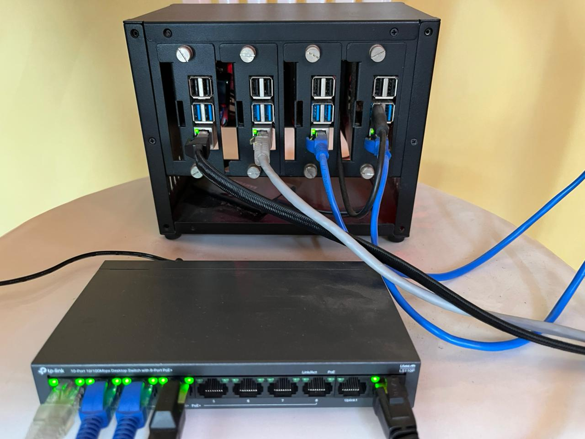
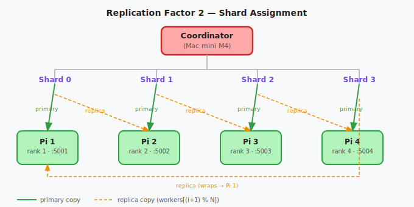
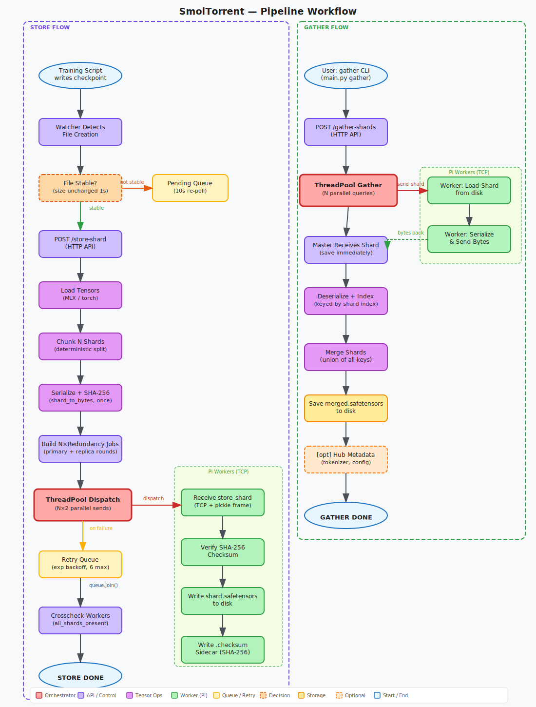
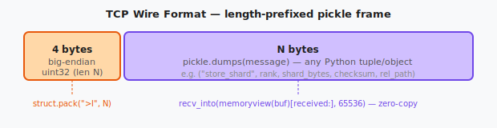

# smoltorrent — Distributing ML Checkpoints Across a Pi Cluster

**A 942 MB checkpoint. Four Raspberry Pis. ~2 minutes. No single point of failure.**

This is a technical writeup of [smoltorrent](https://github.com/YuvrajSingh-mist/smoltorrent) — a distributed checkpoint sharding system I built to offload `.safetensors` checkpoints from my Mac mini to a cluster of Raspberry Pi 4s over raw TCP. It shards, replicates, verifies integrity, and reassembles. 
The watcher daemon does all of it automatically the moment training writes a file. Grafana + Prometheus monitoring shows transfer progress and health without SSH. The whole thing is open source on [GitHub](https://github.com/YuvrajSingh-mist/smoltorrent).

---

## The numbers, upfront

| Metric | Value |
|---|---|
| Checkpoint size tested | 942 MB |
| Workers | 4× Raspberry Pi 4 (4 GB) |
| Transfer time (store) | ~2 min (parallel across workers) |
| Transfer time (gather) | ~2 min (parallel from workers) |
| Network | ~100 Mbps Ethernet + Tailscale VPN |
| Replication factor | 2 (primary + one replica per shard) |
| Single node failure | zero data loss |
| Wire format | `.safetensors` only |

These are real numbers from the actual setup. The Pi cluster is not fast — but it's **parallel**, cheap, and always-on.

---

## The setup

A Mac mini M4 acts as the **coordinator**: it runs the API, the watcher daemon, and the logging (Grafana - Prometheus - Loki) + owns tensor ops (sharding using ```torch.chunk```). Four Raspberry Pi 4s are the **workers**: TCP servers that store and serve shards. Any Linux or macOS machine can fill either role — the Pi is not special here.

| Role | Hardware | Chip | OS | Python | RAM | Storage |
|---|---|---|---|---|---|---|
| **Coordinator** | Apple Mac mini M4 | Apple M4 (arm64) | macOS 26.2 Tahoe | 3.13.3 | 16 GB | 256 GB SSD |
| **Workers × 4** | Raspberry Pi 4 Model B Rev 1.5 | BCM2711 Cortex-A72 (aarch64) | Debian 13 Trixie (kernel 6.12) | 3.13.5 | 4 GB | 64 GB microSD |


*Figure 1 — The worker cluster. 4× Pi 4B in a rack enclosure, connected over Ethernet via a 10/100 MBps TP-Link LS110P PoE switch.*

---

## Zero-config discovery — mDNS + AirDrop (grove)

There are no hardcoded IPs anywhere in this codebase. When a worker starts, it advertises itself over **mDNS** (`_smoltorrent._tcp.local.`) using Zeroconf:

```python
# algorithms/SyncPS/worker.py
_advertiser = advertise_worker(rank=worker_rank, port=my_port, hostname=hostname)
logger.info(f"Worker {worker_rank} advertising on mDNS as smoltorrent-rank-{worker_rank}")
```

The coordinator scans the network and finds all workers automatically. On macOS, **AirDrop / AWDL** discovery runs in parallel — which means two Macs on the same desk can communicate peer-to-peer without going through a router at all.

```bash
# Discover live workers at any time
curl http://localhost:8000/discover 
# → {"workers": [{"ip": "192.168.1.11", "port": 5001, "rank": 1, "hostname": "pi4-1"}, ...]}
```

or 

```bash
grove start main.py -n 4
# → TUI with live mDNS discovery, select workers to form cluster
```

> DHCP just reassigned all your Pi IPs? Doesn't matter. Run `grove join` on each worker and they re-register.

---

## How sharding works

The coordinator loads the checkpoint, splits the tensor dict deterministically into N equal chunks (one per worker), and serializes each chunk to `.safetensors` bytes **before spawning any threads**.

```python
# utils/common_utils.py
def chunk_data(data, n_chunks: int = 10) -> dict:
    idx = torch.tensor(list(range(len(data))))
    chunked_tensors = torch.chunk(idx, n_chunks)
    for chunk_idx, chunk_tensor in enumerate(chunked_tensors):
        data_chunks[chunk_idx] = {
            k: v
            for item_idx, (k, v) in enumerate(data.items())
            if item_idx in chunk_tensor
        }
    return data_chunks
```

`torch.chunk` does the split — the index tensor approach makes the key assignment **fully deterministic** across runs, which matters for gather correctness.

### Replication: the two-round scheme

Each shard is sent twice: once to the primary worker and once to the next worker in a ring. This is done by building jobs in two rounds before dispatching:

```python
# backend/api.py
for round_idx in range(REDUNDANCY):          # REDUNDANCY = 2
    for i, (sb, cs) in enumerate(shards):
        jobs.append((workers[(i + round_idx) % num_workers], sb, cs, round_idx))
```

Round 0: shard `i` → `workers[i]`. Round 1: shard `i` → `workers[(i+1) % N]`. With 4 workers that gives 8 parallel sends total.


*Figure 2 — Each shard goes to two workers. Any single worker can fail — gather falls back to the replica on the next node.*

---

## The store pipeline

The `/store-shard` endpoint is a `StreamingResponse` — it yields log lines as they happen, so you see progress in real time:

```
Loaded 847 tensors (942.3 MB) from grpo/run1/step_100 — chunking into 4 shards
  ✓ rank 1 (pi4-1) [round 0]
  ✓ rank 2 (pi4-2) [round 0]
  ✓ rank 3 (pi4-3) [round 0]
  ✓ rank 4 (pi4-4) [round 0]
  ✓ rank 2 (pi4-2) [round 1]
  ✓ rank 3 (pi4-3) [round 1]
  ✓ rank 4 (pi4-4) [round 1]
  ✓ rank 1 (pi4-1) [round 1]
Done: 8/8 sends (2x replicated) → grpo/run1/step_100
```

All 8 futures run concurrently via `ThreadPoolExecutor`. Failed sends go into a retry queue with exponential backoff (`2^attempt` seconds, up to 6 retries). `store_queue.join()` blocks until every retry is resolved or dead-lettered.


*Figure 3 — Full store (left) and gather (right) pipeline. The watcher auto-triggers store on new files.*

---

## The bug that cost 11 minutes

Early in development the receive loop looked like this:

```python
# OLD — the naive way
data = b""
while True:
    chunk = sock.recv(65536)
    if not chunk:
        break
    data += chunk
```

A 169 MB shard took **13 minutes** to transfer. Not 13 seconds — 13 minutes. CPU was pegged.

The problem: `bytes` is immutable in Python. Every `data += chunk` allocates a brand-new `bytes` object and copies everything from the beginning. For a 169 MB shard arriving in ~2600 chunks of 65 KB each, that's roughly **240 GB of total memory copied**. Classic O(n²).

The fix — pre-allocate a `bytearray` and use `recv_into` with a `memoryview` slice:

```python
# networking/send_receive.py  —  the actual code
buf = bytearray(msglen)         # pre-allocate once, exact size
view = memoryview(buf)          # zero-copy view into it
received = 0
while received < msglen:
    n = sock.recv_into(view[received:], min(65536, msglen - received))
    if not n:
        raise ConnectionError("Socket connection broken while receiving message")
    received += n
result = pickle.loads(buf)
```

`recv_into` writes directly into the buffer — no allocation, no copying. 13 minutes → 2 minutes.

> This is why `recv_into` + `memoryview` exists. The stdlib docs mention it briefly. The 11-minute penalty is how you really learn it.

---

## The wire format

Every message on the wire is a **4-byte big-endian length prefix followed by a pickled payload**. TCP has no message boundaries — without the header, the receiver can't tell where one message ends and the next begins.


*Figure 4 — The framing protocol. The 4-byte uint32 header tells the receiver exactly how many bytes to read.*

```python
# send_message — networking/send_receive.py
data = pickle.dumps(message)
sock.sendall(struct.pack(">I", len(data)) + data)
```

4 bytes supports messages up to ~4 GB. Shards serialize to `safetensors` bytes (not raw pickle), so the actual payload is the tuple `("store_shard", rank, shard_bytes, checksum, rel_path)`.

---

## Workers: dumb TCP servers

Each worker is a TCP listener that dispatches on the first field of the incoming tuple:

```python
# algorithms/SyncPS/worker.py
command, *_ = msg if isinstance(msg, tuple) else (msg,)

if command == "store_shard":
    _, rank, shard_bytes, received_checksum, rel_path = msg
    if compute_checksum(shard_bytes) != received_checksum:
        send_message(conn, ("store_shard_failed", rank, "checksum mismatch"))
        return
    shard = shard_from_bytes(shard_bytes)
    save_file(shard, str(shard_path))
    cksum = compute_checksum(shard_path)
    (shard_dir / "shard.checksum").write_text(cksum)
    send_message(conn, ("store_shard_done", rank, str(shard_path)))
```

Workers verify the SHA-256 checksum before writing — if the bytes were corrupted in transit, the shard is rejected and the master queues a retry. After writing, a `.checksum` sidecar is written alongside `shard.safetensors` for offline integrity detection at startup.

| Command | What the worker does |
|---|---|
| `store_shard` | Verify checksum → deserialize → write to disk → write `.checksum` |
| `send_shard` | Load from disk → serialize → send bytes back |
| `sync` | List existing shard rel_paths for the watcher |
| `checksum_sync` | Re-hash disk file, compare to sidecar |
| `all_shards_present` | Check which paths exist (crosscheck) |
| `heartbeat` | Reply `"alive"` |

---

## Gather: the subtle correctness requirement

When gathering, shards are keyed by **shard index**, not worker rank.

```python
# backend/api.py
with lock:
    shards_by_index[shard_index] = received_shard  # NOT shards_by_rank[rank]
```

This matters when a primary is unreachable and the **replica** serves the shard. If shard 0's primary (rank 1) is down, rank 2 serves it instead — but it must still land in slot 0 for the merge to be correct:

```python
def _gather_one(i: int, worker: dict):
    ok, err, result = _gather_and_save(worker, shard_index=i)
    if not ok and REDUNDANCY > 1:
        replica = workers[(i + 1) % num_workers]
        ok, err, result = _gather_and_save(replica, shard_index=i)  # still index i
    return i, ...
```

Merge is then just:

```python
merged = merge_shards([shards_by_index[i] for i in range(num_workers)])
```

Which is simply `dict.update()` across all shards in index order. The key insight: **it doesn't matter which physical machine served a shard, as long as it lands in the correct index slot**.

---

## The watcher: 4 phases of paranoia

The watcher monitors `ckpt_root` with `watchdog` and triggers a 4-phase sync loop on every new file:

**Phase 1 — file_sync.** Query every worker in parallel to get the set of paths they already have. Take the intersection (paths on *all* workers). Diff against local files. Only transfer the difference.

**Phase 2 — checksum_sync** (startup only). At startup, ask every worker to re-hash all their shards and compare to the `.checksum` sidecar. Catch disk corruption before training continues. Skipped on subsequent triggers — the per-shard SHA-256 at store time already guarantees correctness.

**Phase 3 — transfer.** `POST /store-shard` for each missing file.

**Phase 4 — crosscheck.** Ask every worker if they have every expected path. If anything is missing, re-transfer. This catches partial failures that slipped through the retry queue.

Files detected while still being written go to a **pending list** rather than triggering immediately:

```python
# watcher/watch.py
def _is_stable(path: Path, wait: float = 1.0) -> bool:
    """Return True if file size hasn't changed after wait seconds."""
    before = path.stat().st_size
    time.sleep(wait)
    return path.stat().st_size == before
```

A background thread polls pending files every 10 seconds until stable.

---

## Monitoring

A Prometheus + Grafana + Loki stack runs in Docker on the coordinator. Workers expose per-rank metrics on port `9200+rank`. The coordinator exposes the main scrape endpoint at `/metrics`.

Metrics include per-operation counters, end-to-end wall-clock histograms, send/receive bandwidth gauges, and per-worker error counts. Everything you need to see a slow Pi, a flaky cable, or a shard that keeps retrying — without SSH.

---

## Try it

```bash
# On the coordinator (Mac or Linux):
grove start -n 4          # advertise over mDNS, wait for 4 workers

# On each worker Pi:
grove join                # TUI → select coordinator → auto-registers

# Store a checkpoint manually (watcher handles this automatically):
grove store --ckpt-path ~/checkpoints/run1/step_100/model.safetensors

# Gather it back:
grove gather --ckpt-path ~/checkpoints/run1/step_100/model.safetensors
# → writes merged.safetensors in the same directory
```

For production runs with a fixed cluster, edit `configs/config.yaml` with worker SSH aliases and IPs, then `bash scripts/launch.sh`. The launch script rsync's the project, starts workers in tmux over SSH, and brings the coordinator API up.

---

## Platform notes

| Component | Coordinator | Worker |
|---|---|---|
| Tensor loading | MLX (`mx.load`) | safetensors.torch |
| Serialization | MLX → torch buffer → safetensors bytes | safetensors.torch |
| Deserialization | `mx.load(BytesIO)` | `st_load(bytes)` |
| Disk writes | `mx.save_safetensors` | `safetensors.torch.save_file` |

The coordinator needs Apple Silicon for MLX. Workers are platform-agnostic — torch + safetensors only. The coordinator compiles a `_NamedBytesIO` shim so MLX's `mx.load()` (which requires a `.name` attribute ending in `.safetensors`) can work with an in-memory buffer.

---

## What's next

smoltorrent is a storage layer, not a training framework. The natural next step is tight integration with the training loop — triggering gather automatically at resume, and piping checkpoint metadata (step, loss, model ID) alongside the shard so the coordinator can reconstruct full training state without manual bookkeeping.

The mDNS + AWDL discovery is also worth pushing further — AWDL gives genuine peer-to-peer networking between Apple devices without any router involved, which opens up some interesting topologies for Mac-to-Mac training clusters.

→ [GitHub](https://github.com/YuvrajSingh-mist/smoltorrent) · [Setup Guide](./setup.html)
