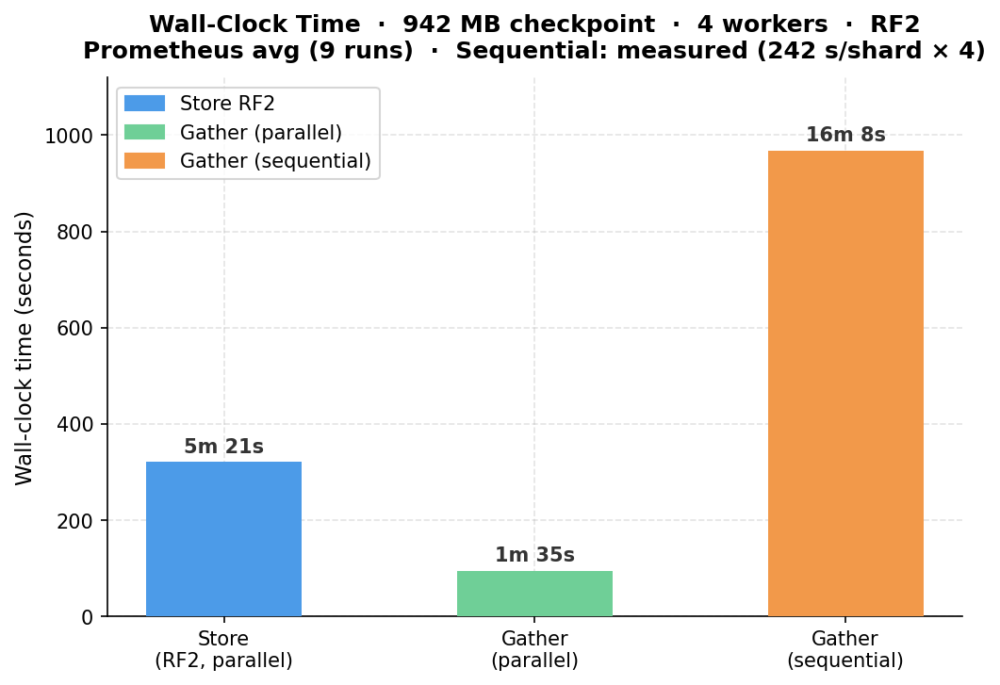
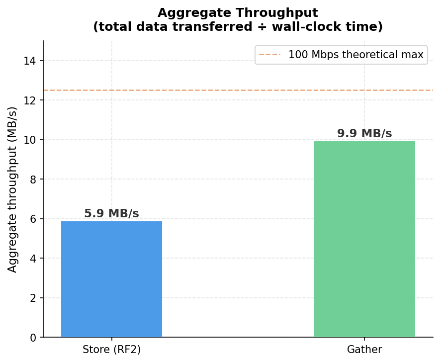
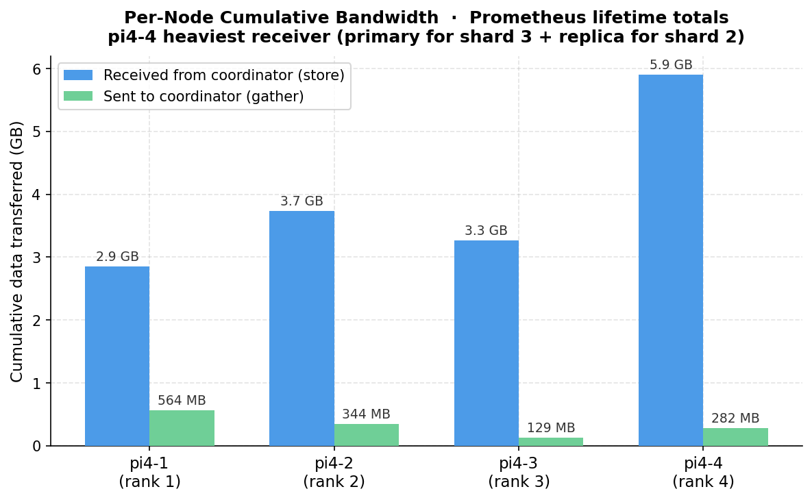
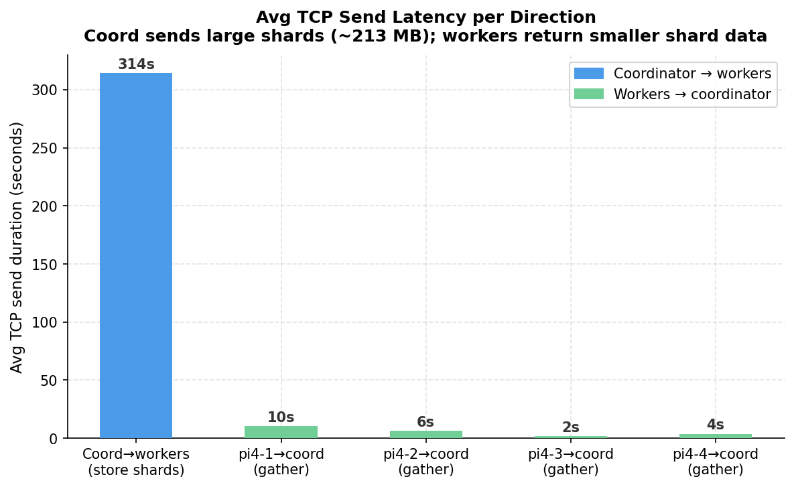
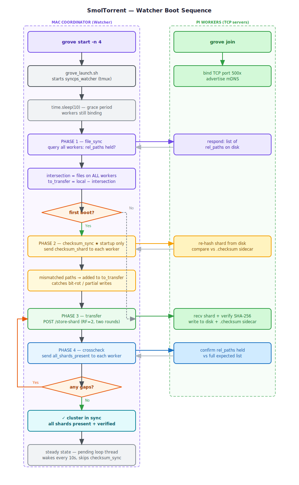

# smoltorrent — Distributing ML Checkpoints Across a Pi Cluster

**A 942 MB checkpoint. Four Raspberry Pis. ~1.5 min gather. No single point of failure.**

[GitHub](https://github.com/YuvrajSingh-mist/smoltorrent) · [Setup Guide](https://yuvrajsingh-mist.github.io/smoltorrent/setup.html)

---

This is a technical writeup of [smoltorrent](https://github.com/YuvrajSingh-mist/smoltorrent) — a distributed checkpoint sharding system I built to offload `.safetensors` checkpoints from my Mac mini to a cluster of Raspberry Pi 4s over raw TCP. It shards, replicates, verifies integrity, and reassembles. 
The watcher daemon does all of it automatically the moment training writes a file. Grafana + Prometheus monitoring shows transfer progress and health without SSH.

---

## The numbers, upfront

| Metric | With redundancy (RF2) | Without redundancy (RF1) |
|---|---|---|
| Checkpoint size tested | 942 MB | 942 MB |
| Workers | 4× Raspberry Pi 4 (4 GB) | 4× Raspberry Pi 4 (4 GB) |
| Store wall time | ~5 min (8 parallel sends) | ~2.5 min (4 parallel sends, est.) |
| Gather wall time | **~1.5 min** (4 parallel reads) | **~16 min** (sequential, measured) |
| Network | ~100 Mbps Ethernet + Tailscale VPN | same |
| Replication factor | 2 (primary + one replica per shard) | 1 (primary only) |
| Single node failure | zero data loss | shard lost |
| Wire format | `.safetensors` only | same |

These are real numbers from the actual setup — store/gather wall times from Prometheus (9 runs), sequential baseline measured directly (242 s/shard × 4 workers). The Pi cluster is not fast — but **parallel gather is ~10× faster than sequential**.


*Store RF2: ~321 s · Gather: ~95 s · Sequential gather: ~968 s — Prometheus, 9 runs*


*Gather hits 9.9 MB/s aggregate. Store moves 2× the data (RF2) so 5.9 MB/s aggregate.*


*Lifetime recv/send per Pi from Prometheus. pi4-4 receives the most — it's both primary for shard 3 and replica for shard 2 due to the RF2 ring offset.*


*Coordinator→worker sends avg 314 s each (~213 MB shards). Worker→coordinator sends are shorter — already-stored shards served from microSD.*

---

# Why this setup?

A few reasons drove this project:
1. **Cost.** A 1 TB NVMe SSD costs around $100. A 4× Pi cluster with 64 GB microSD cards costs around $200 — but the Pi's storage is effectively free since it's not used for anything else. The cluster can also be repurposed for other tasks when not checkpointing.
2. **Learning.** A great way to learn about distributed systems for storage is to build one from scratch.
3. **Well...I rewrite my checkpoits for projects very Frequently**: One of the main reasons I built smoltorrent was to avoid the hassle of manually copying checkpoints back and forth between my Mac and an external drive...because i keep rewrting the existing ones.

I know the obvious answer is
>*just upload checkpoints to Hugging Face/S3/etc*

but I wanted to understand what actually happens underneath distributed storage systems, so I built a tiny checkpoint replication system from scratch over raw TCP sockets.

The goal was simple:
replicate training checkpoints across cheap cluster nodes so a single SSD/SD-card death wouldn’t kill long-running training.

## Current design:

* coordinator splits safetensors into shards
* each shard replicated to 2 workers
* SHA-256 verification on every transfer
* automatic fallback to replica during restore
* filesystem watcher retries incomplete checkpoints until finalized
* Prometheus/Grafana/Loki stack for monitoring + alerts
* mDNS discovery to get rid of hardcoded IPs

---

## The setup

A Mac mini M4 acts as the **coordinator**: it runs the API, the watcher daemon, and the logging (Grafana - Prometheus - Loki) + owns tensor ops (sharding using ```torch.chunk```). Four Raspberry Pi 4s are the **workers**: TCP servers that store and serve shards. Any Linux or macOS machine can fill either role — the Pi is not special here.

| Role | Hardware | Chip | OS | Python | RAM | Storage |
|---|---|---|---|---|---|---|
| **Coordinator** | Apple Mac mini M4 | Apple M4 (arm64) | macOS 26.2 Tahoe | 3.13.3 | 16 GB | 256 GB SSD |
| **Workers × 4** | Raspberry Pi 4 Model B Rev 1.5 | BCM2711 Cortex-A72 (aarch64) | Debian 13 Trixie (kernel 6.12) | 3.13.5 | 4 GB | 64 GB microSD |


*Figure 1 — The worker cluster. 4× Pi 4B in a rack enclosure, connected over Ethernet via a 10/100 MBps TP-Link LS110P PoE switch.*

> For the full cluster build walkthrough — hardware selection, PoE switch setup, SD card prep, and OS config — see the [smoltorrent build blog post](https://yuvrajsingh.io/blogs/smoltorrent).

---

## What happens when everything boots up



*Figure — Watcher boot sequence. Left lane: Mac coordinator. Right lane: Pi workers. Startup-only path (checksum_sync) shown in amber; loop-back on gaps shown in red.*

### After that: steady-state

- The watcher enters its event loop. A separate **pending loop** thread wakes every 10 seconds to check for files that were recently modified but haven't stabilised yet. 
- When a new checkpoint lands in `ckpt_root`, it goes through the same pipeline — minus checksum_sync — and the cluster is back in sync within seconds.

---

## Restart behaviour and daemon setup

The whole point of the daemon layer is that reboots are invisible to the cluster. Here is exactly what is registered, and what happens under each failure mode.

### Daemon registration

**Coordinator (macOS)** — registered as a `LaunchDaemon` under `/Library/LaunchDaemons/com.smoltorrent.startup.plist`. On boot, macOS runs `smoltorrent_startup.sh` as root (but with `UserName` set so processes inherit the user environment). The startup script does not launch immediately — it polls Tailscale first:

```bash
# scripts/smoltorrent_startup.sh
until ping -c1 -W1 "$TAILSCALE_PROBE" >/dev/null 2>&1; do
    sleep 5
done
# once pi4-1 is reachable → call launch.sh
bash "$SMOLTORRENT_DIR/scripts/launch.sh"
```

`TAILSCALE_PROBE` is set to pi4-1's Tailscale IP. If the network isn't up within 5 minutes, the script aborts. Once the probe succeeds, `launch.sh` starts the FastAPI server (`syncps_api`) and the watcher (`syncps_watcher`) in named tmux windows. The daemon exits after handing off to tmux — `launchctl print` showing `last exit code = 1` and `state = not running` is normal.

**Workers (Raspberry Pi)** — registered as a `systemd` service (`smoltorrent-worker`) installed by `scripts/install_worker_service.sh`. The unit file sets `Restart=always` with a short restart delay, so if `worker.py` crashes or the Pi reboots, systemd brings it back automatically. On startup, `worker.py` binds its TCP port and broadcasts over mDNS — it is ready to accept connections before the coordinator's watcher even wakes up.

---

### Scenario A — coordinator restarts, workers still up

Workers never stopped. Their shards are still on disk (microSD is persistent). Their TCP sockets are bound, mDNS is still broadcasting.

Coordinator sequence after reboot:
1. `smoltorrent_startup.sh` polls Tailscale until pi4-1 responds
2. `launch.sh` starts API + watcher in tmux
3. Watcher sleeps 10 s (`time.sleep(10)`)
4. **file_sync** — queries all 4 workers; each responds with their full rel_paths list (everything they had before the coordinator went down)
5. **checksum_sync** (`startup=True`) — asks every worker to re-hash each shard and compare against its `.checksum` sidecar; any shard that was half-written during the previous crash is caught here and flagged
6. **transfer** — sends anything flagged by checksum_sync plus any local files the workers don't have yet
7. **crosscheck** — final per-worker confirmation; re-transfers anything still missing

Result: the coordinator picks up exactly where it left off. Any checkpoint that was mid-transfer when the coordinator crashed gets retransferred cleanly. Workers that were fully synced report nothing missing and checksum_sync passes — no unnecessary re-transfers.

---

### Scenario B — workers restart (Pi reboots), coordinator still up

The coordinator's watcher is running in steady-state — it is waiting on `trigger.wait()`. A worker rebooting does not set the trigger. The coordinator does not know a worker went away until the next file event or pending-loop tick.

When the Pi comes back:
1. systemd restarts `worker.py` automatically (`Restart=always`)
2. `worker.py` binds TCP, broadcasts mDNS — shards still on disk from before the reboot
3. The next time the coordinator's `file_sync` runs (triggered by a new checkpoint or the pending loop), it queries all workers including the restarted Pi
4. The Pi responds with its full rel_paths list — same shards it had before
5. No re-transfer needed; the intersection includes its paths again

If the Pi's microSD lost data (corruption, power loss mid-write), `checksum_sync` would catch the mismatch on the next startup sweep. But that only runs at watcher startup, not on file events. The workaround: restart the watcher (`kill` the tmux window and `grove_launch.sh` again) to force a new startup sweep, or wait for the next full coordinator reboot.

During the window between the Pi rebooting and its TCP port binding (~5–15 s for systemd + Python startup), `_sync_worker` uses `settimeout(0.2)` for connect — it simply skips unreachable workers rather than blocking:

```python
# watcher/watch.py — _sync_worker
sock.settimeout(0.2)
sock.connect((worker["ip"], worker["port"]))  # fast-fail if not up yet
```

The intersection is computed from reachable workers only, so a transiently-down Pi doesn't block transfers to the other three.

---

### Scenario C — both restart at the same time

This is the race. Both sides are coming up simultaneously — the coordinator's watcher might fire its initial file_sync before all workers have bound their TCP ports.

What actually happens:

1. Workers start coming up — each binds TCP and starts mDNS within ~5–15 s of systemd firing
2. Coordinator's `smoltorrent_startup.sh` waits for Tailscale (pi4-1 reachable) — this already implies pi4-1's network stack is up, but its `worker.py` may not be bound yet
3. Watcher starts, sleeps **10 s** — this grace period exists precisely for this race. Workers that are fast (pi4-1, pi4-2) will be ready; slower ones might not
4. **file_sync** at t=10 s — workers that haven't bound yet get `(False, set())` from `_sync_worker` (0.2 s timeout, connect refused) and are excluded from the intersection
5. The intersection is smaller than it should be — to_transfer includes files the late-binding workers should have but the watcher thinks they don't
6. **transfer** runs and pushes shards to the late workers anyway (they might be up by now)
7. **crosscheck** at the end queries all workers with `settimeout(1.0)` — by this point all workers are almost certainly bound; any that report missing shards get a re-transfer
8. The retry queue with exponential backoff (`2^attempt`, up to 6 retries) handles the case where a worker is still coming up during the transfer phase

The worst case: a worker binds after the crosscheck. The watcher is now in steady-state waiting for the next file event. That worker has no shards. The next time a new checkpoint lands, file_sync queries it, sees it has nothing, and transfers everything it should have. No permanent data loss — just a window where one worker is empty. Since replication factor is 2, the replica on the adjacent worker covers any gather request during that window.

---

# The Core Funcionality - Explained!

## Zero-config discovery — mDNS + AirDrop (grove)

There are no hardcoded IPs anywhere in this codebase. When a worker starts, it advertises itself over **mDNS** (`_smoltorrent._tcp.local.`) using Zeroconf:

```python
# algorithms/SyncPS/worker.py
_advertiser = advertise_worker(rank=worker_rank, port=my_port, hostname=hostname)
logger.info(f"Worker {worker_rank} advertising on mDNS as smoltorrent-rank-{worker_rank}")
```

The coordinator scans the network and finds all workers automatically. On macOS, **AirDrop / AWDL** discovery runs in parallel — which means two Macs on the same desk can communicate peer-to-peer without going through a router at all.

```bash
# Discover live workers at any time
curl http://localhost:8000/discover 
# → {"workers": [{"ip": "192.168.1.11", "port": 5001, "rank": 1, "hostname": "pi4-1"}, ...]}
```

or 

```bash
grove start main.py -n 4
# → TUI with live mDNS discovery, select workers to form cluster
```

> DHCP just reassigned all your Pi IPs? Doesn't matter. Run `grove join` on each worker and they re-register. 

*Hail mDNS/Zeroconf for making this seamless.*

---


## How sharding works

The coordinator loads the checkpoint, splits the tensor dict deterministically into N equal chunks (one per worker), and serializes each chunk to `.safetensors` bytes **before spawning any threads**.

```python
# utils/common_utils.py
def chunk_data(data, n_chunks: int = 10) -> dict:
    idx = torch.tensor(list(range(len(data))))
    chunked_tensors = torch.chunk(idx, n_chunks)
    data_chunks = {}

    for chunk_idx, chunk_tensor in enumerate(chunked_tensors):

        data_chunks[chunk_idx] = {
            k: v for item_idx, (k, v) in enumerate(data.items())
            if item_idx in chunk_tensor
        }

    return data_chunks
```

`torch.chunk` does the split — the index tensor approach makes the key assignment **fully deterministic** across runs, which matters for gather correctness.

For example, a checkpoint split across 3 workers:

**Even (6 tensors ÷ 3 workers = 2 each):**

```python
data = {
    "embed.weight":   tensor(...),  # item 0
    "layer0.weight":  tensor(...),  # item 1
    "layer0.bias":    tensor(...),  # item 2
    "layer1.weight":  tensor(...),  # item 3
    "layer1.bias":    tensor(...),  # item 4
    "head.weight":    tensor(...),  # item 5
}

chunk_data(data, n_chunks=3)
# {
#   0: {"embed.weight": ...,  "layer0.weight": ...},  # items 0-1 → worker 1
#   1: {"layer0.bias": ...,   "layer1.weight": ...},  # items 2-3 → worker 2
#   2: {"layer1.bias": ...,   "head.weight":   ...},  # items 4-5 → worker 3
# }
```

**Odd (7 tensors ÷ 3 workers — last worker gets 1):**

```python
data = {
    "embed.weight":   tensor(...),  # item 0
    "layer0.weight":  tensor(...),  # item 1
    "layer0.bias":    tensor(...),  # item 2
    "layer1.weight":  tensor(...),  # item 3
    "layer1.bias":    tensor(...),  # item 4
    "layer2.weight":  tensor(...),  # item 5
    "head.weight":    tensor(...),  # item 6
}

chunk_data(data, n_chunks=3)
# torch.chunk with 7 items, 3 chunks → sizes [3, 3, 1]
# {
#   0: {"embed.weight": ...,  "layer0.weight": ..., "layer0.bias": ...},  # items 0-2 → worker 1
#   1: {"layer1.weight": ..., "layer1.bias": ...,   "layer2.weight": ...},# items 3-5 → worker 2
#   2: {"head.weight": ...},                                               # item  6   → worker 3
# }
```

`torch.chunk` uses `ceil(n / chunks)` as the chunk size, so the last worker gets the remainder — here just 1 tensor.

Each chunk is serialized to `.safetensors` bytes and sent over TCP.

## Replication: the two-round scheme

Each shard is sent twice: once to the primary worker and once to the next worker in a ring. This is done by building jobs in two rounds before dispatching:

```python
# backend/api.py
for round_idx in range(REDUNDANCY):          # REDUNDANCY = 2
    for i, (sb, cs) in enumerate(shards):
        jobs.append((workers[(i + round_idx) % num_workers], sb, cs, round_idx))
```

Round 0: shard `i` → `workers[i]`. Round 1: shard `i` → `workers[(i+1) % N]`. With 4 workers that gives 8 parallel sends total.


*Figure 2 — Each shard goes to two workers. Any single worker can fail — gather falls back to the replica on the next node.*

---

## The store pipeline

The `/store-shard` endpoint is a `StreamingResponse` — it yields log lines as they happen, so you see progress in real time:

```
Loaded 847 tensors (942.3 MB) from grpo/run1/step_100 — chunking into 4 shards
  ✓ rank 1 (pi4-1) [round 0]
  ✓ rank 2 (pi4-2) [round 0]
  ✓ rank 3 (pi4-3) [round 0]
  ✓ rank 4 (pi4-4) [round 0]
  ✓ rank 2 (pi4-2) [round 1]
  ✓ rank 3 (pi4-3) [round 1]
  ✓ rank 4 (pi4-4) [round 1]
  ✓ rank 1 (pi4-1) [round 1]
Done: 8/8 sends (2x replicated) → grpo/run1/step_100
```


All 8 futures run concurrently via `ThreadPoolExecutor`.

### Checksums and Why they are necessary

TCP guarantees delivery order but not data integrity — a bit flip in a router buffer, an SD card write error, or a memory fault can corrupt bytes that TCP happily delivers. Without verification you'd silently store garbage and only discover it at resume time when the model fails to load.

Every shard gets a SHA-256 checksum computed on the coordinator **before** the bytes leave:

```python
checksum = hashlib.sha256(shard_bytes).hexdigest()
send_message(sock, ("store_shard", rank, shard_bytes, checksum, rel_path))
```
> In practice, its done through loading the weights stored in `.safetensors` in chunks of certain size so as to not lead to OOM.  

The worker recomputes the hash on arrival and rejects the shard if they don't match:

```python
if compute_checksum(shard_bytes) != received_checksum:
    send_message(conn, ("store_shard_failed", rank, "checksum mismatch"))
    return   # master queues a retry
```

After a successful write, the worker also hashes the **file on disk** and saves it as a `.checksum` sidecar next to `shard.safetensors`. 
This second hash catches SD card corruption that happens after the transfer. So, every time the watcher starts up, `checksum_sync` re-hashes every existing shard and compares against its stored ```.checksum``` file, flagging anything that decayed on disk for re-transfer.

So checksums do two jobs: **transit integrity** (coordinator → worker, verified in memory) and **storage integrity** (worker disk, verified at startup via the sidecar).

Failed sends go into a retry queue with exponential backoff (`2^attempt` seconds, up to 6 retries). `store_queue.join()` blocks until every retry is resolved or dead-lettered.


*Figure 3 — Full store (left) and gather (right) pipeline. The watcher auto-triggers store on new files.*

---

## The bug that costed precious bandwidth

Early in development the receive loop looked like this:

```python
# OLD — the naive way
data = b""
while True:
    chunk = sock.recv(65536)
    if not chunk:
        break
    data += chunk
```

A 169 MB shard took **13 minutes** to transfer. Not 13 seconds — 13 minutes. CPU was pegged.

The problem: `bytes` is immutable in Python. Every `data += chunk` allocates a brand-new `bytes` object and copies everything from the beginning. For a 169 MB shard arriving in ~2600 chunks of 65 KB each, that's roughly **240 GB of total memory copied**. Classic O(n²).

The fix — pre-allocate a `bytearray` and use `recv_into` with a `memoryview` slice:

```python
# networking/send_receive.py  —  the actual code
buf = bytearray(msglen)         # pre-allocate once, exact size
view = memoryview(buf)          # zero-copy view into it
received = 0
while received < msglen:
    n = sock.recv_into(view[received:], min(65536, msglen - received))
    if not n:
        raise ConnectionError("Socket connection broken while receiving message")
    received += n
result = pickle.loads(buf)
```

`recv_into` writes directly into the buffer — no allocation, no copying. 13 minutes → 2 minutes.

> In short, this is why `recv_into` + `memoryview` exists, saved the day (and bandwidth from going to almost decaying)!

---

## The wire format

Every message on the wire is a **4-byte big-endian length prefix followed by a pickled payload**. TCP has no message boundaries — without the header, the receiver can't tell where one message ends and the next begins.


*Figure 4 — The framing protocol. The 4-byte uint32 header tells the receiver exactly how many bytes to read.*

```python
# send_message — networking/send_receive.py
data = pickle.dumps(message)
sock.sendall(struct.pack(">I", len(data)) + data) 
```

4 bytes supports messages up to ~4 GB. Shards serialize to `safetensors` bytes (not raw pickle), so the actual payload is the tuple `("store_shard", rank, shard_bytes, checksum, rel_path)`.

> - ```>I``` refers to Big-endian meaning the most significant byte is sent first. This is a common convention for network protocols (aka "network byte order") to ensure consistency across different architectures.
>- `sock.sendall()` ensures that all bytes are sent before returning, handling partial sends internally. This is crucial for large messages that may not be sent in one go.
>- `pickle.dumps()` serializes the Python object (tuple in this case) into bytes, which can then be sent over the network. The receiver will use `pickle.loads()` to deserialize it back into a Python object.
>- ```struct``` is required to pack the length of the data (```>I```, ```len(data)```) into a fixed-size byte format that can be easily read by the receiver to determine how many bytes to expect for the actual message. 
>Why not use pickle? Well, it is mainly used for conversion of hierarchical objects with some metadata not required in this case.
---

## Workers: TCP servers

Each worker is a TCP listener that dispatches on the first field of the incoming tuple:

```python
# algorithms/SyncPS/worker.py
command, *_ = msg if isinstance(msg, tuple) else (msg,)

if command == "store_shard":
    _, rank, shard_bytes, received_checksum, rel_path = msg
    if compute_checksum(shard_bytes) != received_checksum:
        send_message(conn, ("store_shard_failed", rank, "checksum mismatch"))
        return
    shard = shard_from_bytes(shard_bytes)
    save_file(shard, str(shard_path))
    cksum = compute_checksum(shard_path)
    (shard_dir / "shard.checksum").write_text(cksum)
    send_message(conn, ("store_shard_done", rank, str(shard_path)))
```

Workers verify the SHA-256 checksum before writing — if the bytes were corrupted in transit, the shard is rejected and the master queues a retry. After writing, a `.checksum` sidecar is written alongside `shard.safetensors` for offline integrity detection at startup.

| Command | What the worker does |
|---|---|
| `store_shard` | Verify checksum → deserialize → write to disk → write `.checksum` |
| `send_shard` | Load from disk → serialize → send bytes back |
| `sync` | List existing shard rel_paths for the watcher |
| `checksum_sync` | Re-hash disk file, compare to sidecar |
| `all_shards_present` | Check which paths exist (crosscheck) |
| `heartbeat` | Reply `"alive"` |

---

## Gather: the subtle correctness requirement

When gathering, shards are keyed by **shard index**, not worker rank.

```python
# backend/api.py
with lock:
    shards_by_index[shard_index] = received_shard  # NOT shards_by_rank[rank]
```

This matters when a primary is unreachable and the **replica** serves the shard. If shard 0's primary (rank 1) is down, rank 2 serves it instead — but it must still land in slot 0 for the merge to be correct:

```python
def _gather_one(i: int, worker: dict):
    ok, err, result = _gather_and_save(worker, shard_index=i)
    if not ok and REDUNDANCY > 1:
        replica = workers[(i + 1) % num_workers]
        ok, err, result = _gather_and_save(replica, shard_index=i)  # still index i
    return i, ...
```

Merge is then just:

```python
merged = merge_shards([shards_by_index[i] for i in range(num_workers)])
```


---

## The watcher: 4 phases of paranoia

The watcher monitors `ckpt_root` with `watchdog` and triggers a 4-phase sync loop on every new file:

**Phase 1 — file_sync.** Query every worker in parallel to get the set of paths they already have. Take the intersection (paths on *all* workers). Diff against local files. Only transfer the difference.

**Phase 2 — checksum_sync** (startup only). At startup, ask every worker to re-hash all their shards and compare to the `.checksum` sidecar. Catch disk corruption before training continues. Skipped on subsequent triggers — the per-shard SHA-256 at store time already guarantees correctness.

**Phase 3 — transfer.** `POST /store-shard` for each missing file.

**Phase 4 — crosscheck.** Ask every worker if they have every expected path. If anything is missing, re-transfer. This catches partial failures that slipped through the retry queue.

Files detected while still being written go to a **pending list** rather than triggering immediately:

```python
# watcher/watch.py
def _is_stable(path: Path, wait: float = 1.0) -> bool:
    """Return True if file size hasn't changed after wait seconds."""
    before = path.stat().st_size
    time.sleep(wait)
    return path.stat().st_size == before
```

A background thread polls pending files every 10 seconds until stable.

---

## Monitoring

A Prometheus + Grafana + Loki stack runs in Docker on the coordinator. Workers expose per-rank metrics on port `9200+rank`. The coordinator exposes the main scrape endpoint at `/metrics`.

Metrics include per-operation counters, end-to-end wall-clock histograms, send/receive bandwidth gauges, and per-worker error counts. Everything you need to see a slow Pi, a flaky cable, or a shard that keeps retrying — without SSH.

---

## Try it

Full setup instructions, config reference, and CLI usage are on the **[smoltorrent docs →](https://yuvrajsingh-mist.github.io/smoltorrent/setup.html)**

---


## Challenges

None of this worked on the first try. Here are every real problem hit, in the order they appear in the design doc.

---

### Wire format — safetensors (`utils/common_utils.py`)

Coordinator runs MLX, Pi workers run torch. Two serializers failed:

- **Pickle** — pickling an `mlx.core.array` embeds the class. Unpickling on a Pi tries `import mlx`, which isn't installed. Hard crash.
- **Numpy** — `bfloat16` raises a PEP 3118 item-size mismatch. Fails silently or corrupts.

Safetensors is the fix — flat format (shape + dtype string + raw bytes), no framework embedded. Readable by both `mx.load()` and `safetensors.torch.load()`.

Serialization path on coordinator (`shard_to_bytes`):
1. `bytes(mlx_array)` — MLX exposes raw memory via the buffer protocol, no numpy dtype interpretation
2. `torch.frombuffer(bytearray(...), dtype=...)` — reinterprets those bits as the correct torch dtype
3. `safetensors.torch.save(torch_dict)` — produces the bytes that go on the wire

On Pi: `safetensors.torch.load(received_bytes)` → torch tensors → saved to disk as `.safetensors`. Safetensors is used as the wire format, not just for disk storage.

---

### MLX gather save bug (`backend/api.py`)

`/gather-shards` received shard bytes from a Pi and called `safetensors.torch.save_file(received_shard, path)` on the coordinator to cache it locally. On the coordinator, `shard_from_bytes` deserializes to MLX arrays — not torch tensors. `safetensors.torch.save_file` expects torch tensors:

```
Key embed_tokens.weight is invalid, expected torch.Tensor but received mlx.core.array
```

Fix: replaced with `_save_shard()` from `common_utils`, which branches on `_IS_MAC` and calls `mx.save_safetensors()` on macOS.

---

### Reliability — retry queue + checksum (`backend/api.py`)

A flaky worker should not block the other three or silently corrupt data.

- SHA-256 checksum computed on shard bytes before sending; worker verifies on receipt
- Workers write a `.checksum` sidecar file alongside each `shard.safetensors` for later corruption detection
- Failed sends go onto a daemon retry thread with exponential backoff (`2^attempt` seconds, up to `MAX_RETRIES=6`)
- Main loop does not wait on failures — all workers are dispatched first, retry thread runs alongside
- `store_queue.join()` is the single wait point before returning
- Permanently failed shards go to `dead_letter` and are reported in the response

---
    

### Crosscheck command (`algorithms/SyncPS/worker.py`)

Added `all_shards_present` command: coordinator sends `(rank, [rel_paths])`, worker checks each `shards/worker_{rank}/{rel_path}/shard.safetensors` exists, returns list of missing rel_paths. Coordinator re-transfers anything non-empty.

---

### Double serialization bug (`backend/api.py`)

`/store-shard` serialized each shard once (to compute checksum), then passed the raw dict to `_send_shard_to_worker`, which serialized it again after the socket was open. Second serialization stalled long enough that the worker saw `"Socket connection broken"`.

Fix: `_send_shard_to_worker` takes `shard_bytes: bytes` directly. Serialized once, reused for both checksum and send.

---

### Socket timeout bug (`backend/api.py`)

`_connect_with_retry` set `sock.settimeout(2.0)` for the connect attempt and never cleared it. Every `sendall` on the returned socket had a 2s deadline. A 70 MB shard over Tailscale blows past that — the shard starts sending, hits the timeout mid-transfer, and the worker sees `ConnectionError: Socket connection broken`. The retry queue reconnects and fails identically.

Fix: `send_message` and `receive_message` in `send_receive.py` both call `sock.settimeout(None)` as their first line — timeout cleared unconditionally before any data transfer.

---

### Serialization vs pickling (`networking/send_receive.py`)

Two different serializers for two different jobs:

- **Pickle** — serializes the message tuple `("store_shard", rank, shard_bytes, ...)` for TCP transport. Fine on both coordinator and Pi because the tuple contains only plain Python types. `shard_bytes` inside the tuple is already a `bytes` object — pickle treats it as an opaque blob.
- **Safetensors** — serializes the tensor data into `shard_bytes` before pickle sees it. Needed because pickling MLX arrays directly embeds the `mlx.core.array` class — unpickling on Pi would `import mlx`, which isn't installed.

Rule: pickle handles structure, safetensors handles tensors. Never let pickle see raw MLX arrays.

---

### Streaming progress (`backend/api.py`, `utils/shard_ops.py`)

Both endpoints return `text/plain` streaming responses. The server yields the same lines it logs, one per event. The client reads with `httpx.stream` and passes each line straight to `logger.info` — no JSON, no event parsing, client is just a pipe.

HTTP status code is committed in headers before streaming starts, so mid-stream errors are signalled as `ERROR: ...` lines instead of a 500 status.

---

### Gather saves on arrival (`backend/api.py`)

Previously gathered all shards into memory then saved at the end — a mid-gather failure discarded everything. Now `_gather_and_save` wraps pull + save together; each shard hits disk as soon as it arrives. Retry thread uses the same function.

---

### O(n²) receive bug (`networking/send_receive.py`)

The receive loop built the buffer with `data += chunk`. `bytes` is immutable in Python — every `+=` allocates a new object and copies all bytes received so far into it. For a 169 MB shard received in ~2700 chunks of 65 KB each, total bytes copied is roughly `sum(1..2700) × 65 KB ≈ 240 GB`. On a Pi with slow microSD backing swap, this was catastrophic — a 2-minute transfer became 13 minutes.

```python
# before
data = b""
while remaining > 0:
    chunk = sock.recv(min(65536, remaining))
    data += chunk  # copies everything every iteration

# after
buf = bytearray(msglen)
view = memoryview(buf)
received = 0
while received < msglen:
    n = sock.recv_into(view[received:], min(65536, msglen - received))
    received += n
```

Pre-allocate a single `bytearray` of the exact message length, wrap in a `memoryview`, use `recv_into` to write each chunk directly at the right offset. Zero copies, zero allocations after the initial one. 13 min → 2 min on a 676 MB checkpoint.

---

### macOS TCC + LaunchDaemon (`scripts/launch.sh`, `scripts/smoltorrent_startup.sh`)

macOS TCC blocks system daemons (running as root) from accessing `~/Desktop`, `~/Documents`, and `~/Downloads`. The project was at `~/Desktop/smoltorrent/` and checkpoints at `~/Desktop/smolcluster/checkpoints/` — the LaunchDaemon registered fine, ran at boot, then silently found nothing. No error, no log.

Fix: moved code to `~/smoltorrent/` and checkpoints to `~/smolcluster/checkpoints/`. Startup script copied to `/usr/local/bin/` (TCC-safe) before registration.

---

### macOS 26 Tahoe LaunchDaemon registration

Every traditional auto-start API was broken:

- `launchctl load` → SIGABRT, exit 134 — API removed in Tahoe
- `launchctl bootstrap gui/<UID>` → error 125 — GUI domain broken in beta
- `~/Library/LaunchAgents/` → silently ignored — requires `SMAppService` from Swift now

The only working sequence:

```bash
sudo launchctl bootout system/com.smoltorrent.startup 2>/dev/null || true
sudo launchctl bootstrap system /Library/LaunchDaemons/com.smoltorrent.startup.plist
sudo launchctl enable system/com.smoltorrent.startup
```

The plist requires `UserName` (so it runs as the user, not root) and `EnvironmentVariables` with `PATH` including `/opt/homebrew/bin` — otherwise `uv`, `tmux`, and `brew` aren't found at boot since the daemon doesn't load your shell profile.

`launchctl print` showing `state = not running` and `last exit code = 1` after boot is expected — the daemon runs once, launches everything into tmux, then exits. The cluster runs independently in tmux.

---

## Closing thoughts

Started off as a soltuion to a frustrating problem of me keet rew-trting my checkpoints. It ended up being the most educational thing I've built — not because distributed systems are complicated in theory, but because the gap between "it works on my machine" and "it works when two things reboot at the same time" is where all the real engineering lives.

The bugs that hurt the most weren't logic errors. They were assumption errors: assuming `bytes +=` is fine for large buffers, assuming a socket timeout set for connect is cleared before send, assuming the same serializer works on both sides of a framework boundary, assuming macOS APIs from 2020 still work on Tahoe. Each one cost hours. Each one is now a comment in the code or a line in this post.


This distributed checkpointing will be my go-to drive for saving ML checkpoints now. Training runs write checkpoints, the watcher distributes them, Grafana shows everything is healthy. No manual copying, no SSH sessions, no lost checkpoints. For four Raspberry Pis on a shelf, that's good enough.

Code is on [GitHub](https://github.com/YuvrajSingh-mist/smoltorrent). Setup guide is [here](https://yuvrajsingh-mist.github.io/smoltorrent/setup.html).
